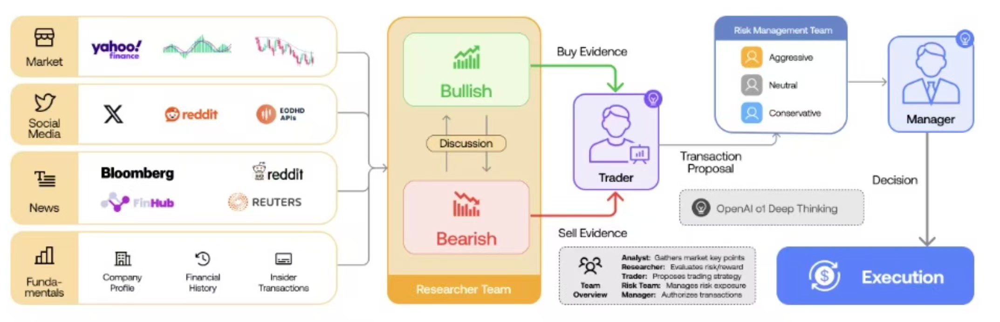
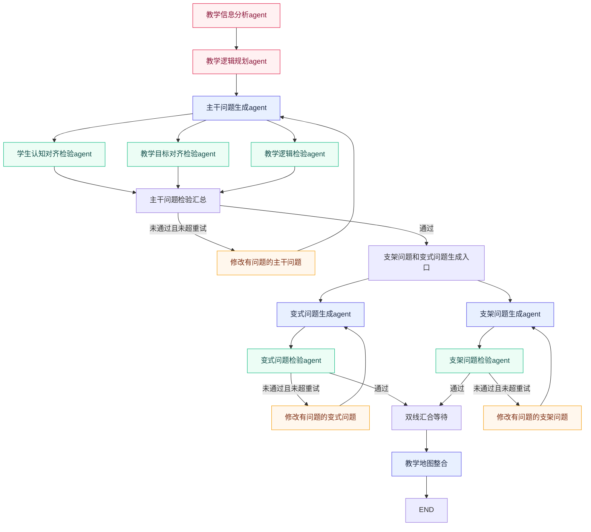
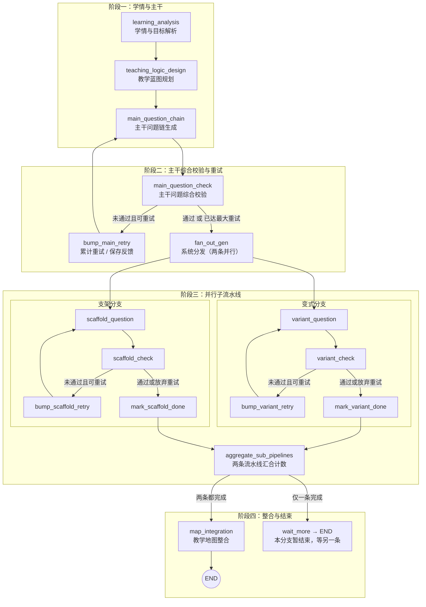

# 1 多智能体框架LangGraph(LangChain)

**LangGraph** 是由 LangChain 团队推出的一个强大扩展库，专门用于构建具备**状态管理**和**多智能体**能力的 LLM 应用程序。

TradingAgents: Multi-Agents LLM Financial Trading Framework

- 该工作的底层代码实现正是基于LangGraph框架

它**基于图（Graph）**的概念，将 AI 工作流建模为节点（Node）和边（Edge）的有向图结构。

- 节点：每一个节点就是一个Agent，不同Agent的职能是不同的
- 边：边决定了不同Agent之间的交互逻辑，不同的Agent通过图的边相互通信和协作

# 2 智能体设置与交互逻辑

基于LangGraph

**共10个Agent**，从功能上看可以分为**三类**：

1. 分析型智能体
   - 教学信息分析Agent
     - 对教学信息进行解析（教学目标、教学知识点、学情）
   - 教学逻辑规划Agent
     - 规划整张教学地图的构建逻辑
2. 生成型智能体
   - 主干问题生成Agent
   - 支架问题生成Agent
   - 变式问题生成Agent
3. 校验型智能体
   - 对于主干问题设置了三个agent对其进行检验
     - 学生认知对齐检验Agent
     - 教学目标对齐检验Agent
     - 教学逻辑检验Agent
   - 对于支架问题和变式问题，各设置了一个Agent对其生成质量进行检验
     - 变式问题检验Agent
     - 支架问题检验Agent

